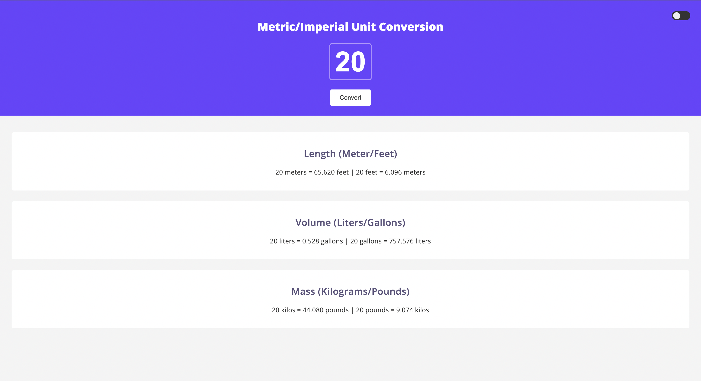

# 🔁 Metric/Imperial Unit Converter

This is a basic yet functional **unit conversion web app** that allows users to convert between metric and imperial systems for **length**, **volume**, and **mass**. Built with vanilla **HTML**, **CSS**, and **JavaScript**, it also features a **dark/light mode toggle** for better accessibility.

🔗 **Live Site:** [https://tiny-liger-f2722c.netlify.app/](https://tiny-liger-f2722c.netlify.app/)

## 📸 Preview

[](https://tiny-liger-f2722c.netlify.app/)

> Screenshot of the app in light mode. Click to visit the live site.

---

## ⚙️ Features

- ✅ Convert between:
  - **Meters ⇄ Feet**
  - **Liters ⇄ Gallons**
  - **Kilograms ⇄ Pounds**
- 🌙 Light/Dark Mode Toggle

## 🛠️ Tech Stack

- **Languages:** HTML, CSS, JavaScript
- **Deployment:** Netlify

## 🧪 How to Run Locally

```bash
git clone https://github.com/ttvaroh/metric-imperial-unit-converter.git
cd metric-imperial-unit-converter
npm install
npm run dev